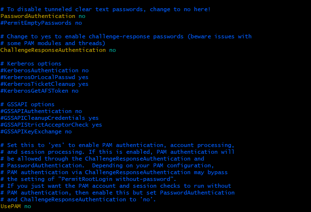

# Assignment on Linux Commands
Your login name: altschool i.e., home directory /home/altschool. The home directory contains the following sub-directories: code, tests, personal, misc Unless otherwise specified, you are running commands (a to m) from the home directory.

## Preamble....
Creating a user with the requested subdirectories in home directory
1. Creating altschool user with home directory, add to sudo group for elevated previllege, assign preferred shell (bash)...
```bash
sudo userdd -m -G sudo -s /bin/bash altschool
```
2. Setting password to with passwd command and follow prompt...
```bash
sudo passwd altschool
```
3. Changing user and getting into user directory simultaneously...
```bash
sudo su -  altschool
```
4. Creating directories in user's home directory...
```bash
mkdir -v code tests personal misc
```


## Solutions....
a. Change directory to the tests directory using absolute pathname
```bash
    cd /home/altschool/tests
```


b. Change directory to the tests directory using relative pathname. 
    ```bash
    cd ../tests
    ```


c. Use echo command to create a file named fileA with text content ‘Hello A’ in the misc directory
```bash 
echo Hello A > ./misc/fileA
```


#### d. Create an empty file named fileB in the misc directory. Populate the file with a dummy content afterwards
```bash
touch ./misc/fileB
head -c 1024 /dev/urandom >>./misc/fileB
```


e. Copy contents of FileA into fileC
```bash
cp ./misc/FileA ./misc/fileC
```


f. Move contents of fileB into fileD
```bash
mv misc/fileB misc/fileD
```


g. Create a tar archive called misc.tar for the contents of misc directory 
```bash
tar -cvf misc.tar ./misc
```


h. Compress the tar archive to create a misc.tar.gz file 
```bash
gzip -kv misc.tar
```  


i. Create a user and force the user to change his/her password upon login
```bash
sudo useradd -m altschool2
```
follow prompt for password
```bash
sudo passwd -e altschool2
```  
or this command below give the same result.
```bash
sudo chage -d 0 altschool2
```


j. Lock a users password
```bash
sudo useradd -m altschool3
```
    
```bash
sudo passwd -l  altschool3
```


k. Create a user with no login shell
```bash
sudo useradd -m -s /sbin/nologin altschoolnoshell` 
```


l. Disable password based authentication for ssh

```bash
vi /etc/ssh/sshd_config
```
Edit the line with PasswordAuthentication from yes to no, and edit the line usePAM from yes to no, 

then saVe and run...
    `service sshd restart`

m. Disable root login for ssh
```bash
vi /etc/ssh/sshd_config
```
Edith or Insert the line  PermitRootLogin no under Authenntication,  
then save and run...
```bash 
    service sshd restart
```

